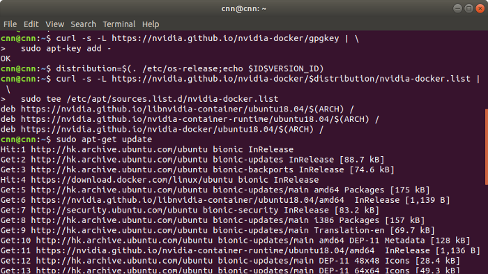
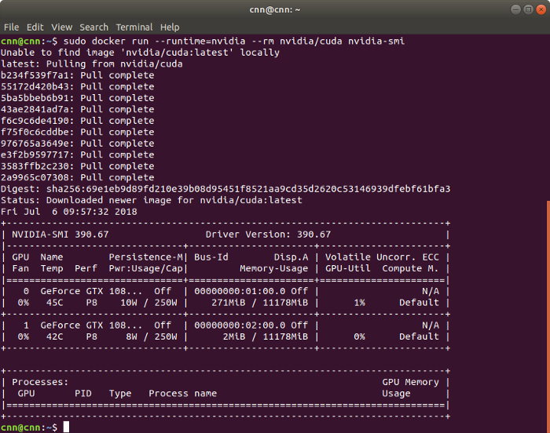
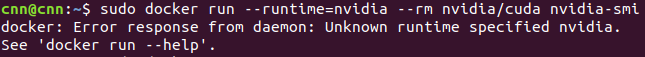
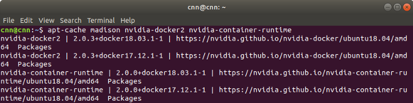
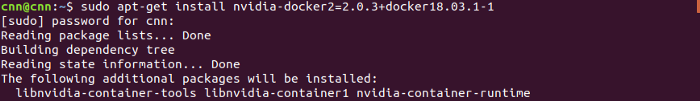
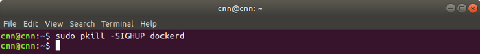

.. raw:: html
   
    <h1 align="center"> Docker: Install and Usage on UBUNTU 18.04 </h1>
     

**Author: Truong Dong Do** 

Updated: January 14, 2021

Documentation
-------------
Latest **documentation** is avaliable on `Read the Docs <https://how-to-use-docker.readthedocs.io/en/latest/>`__

Introduction
**********
`Docker <https://www.docker.com/>`__ is an application that simplifies the process of managing application processes in containers. Containers let you run your applications in resource-isolated processes. They’re similar to virtual machines, but containers are more portable, more resource-friendly, and more dependent on the host operating system.

Prerequisites
**********
- Ubuntu 18.04

0. Install GPU Driver:
********************
- `Check the suitable GPU Driver <https://www.nvidia.com/download/index.aspx?lang=en-us>`_ | `GPU support <https://www.tensorflow.org/install/gpu#software_requirements>`_

.. code:: bash

   # Add NVIDIA package repositories
   wget https://developer.download.nvidia.com/compute/cuda/repos/ubuntu1804/x86_64/cuda-ubuntu1804.pin
   sudo mv cuda-ubuntu1804.pin /etc/apt/preferences.d/cuda-repository-pin-600
   sudo apt-key adv --fetch-keys https://developer.download.nvidia.com/compute/cuda/repos/ubuntu1804/x86_64/7fa2af80.pub
   sudo add-apt-repository "deb https://developer.download.nvidia.com/compute/cuda/repos/ubuntu1804/x86_64/ /"
   sudo apt-get update
   
   # Install NVIDIA driver
   sudo apt-get install --no-install-recommends nvidia-driver-450
   # Reboot. Check that GPUs are visible using the command: nvidia-smi

- Verify NVIDIA Driver:

.. code:: bash

    nvidia-smi

1. Docker 2.0 installation Procedures:
****************************************
1.0. If there is nvidia-docker 1.0 already, it needs to be removed. (Skip it if you do not have it.)
===================================================================================================

.. code:: bash

   docker volume ls -q -f driver=nvidia-docker | xargs -r -I{} -n1 
   docker ps -q -a -f volume={} | xargs -r docker rm -f
   sudo apt-get purge nvidia-docker
   
1.1. Set the repository and update. 
=================================
 
.. code:: bash

   curl -s -L https://nvidia.github.io/nvidia-docker/gpgkey | \
     sudo apt-key add -
   distribution=$(. /etc/os-release;echo $ID$VERSION_ID)
   curl -s -L https://nvidia.github.io/nvidia-docker/$distribution/nvidia-docker.list | \
     sudo tee /etc/apt/sources.list.d/nvidia-docker.list
   sudo apt-get update
  

1.2. Install nvidia-docker 2.0. 
=================================

.. code:: bash

   sudo apt-get install nvidia-docker2
   sudo pkill -SIGHUP dockerd

If you get the successfully installation. Verify it by run the nvidia-docker 2.0:

.. code:: bash
   
   sudo docker run --runtime=nvidia --rm nvidia/cuda nvidia-smi
   

The nvidia image can be pulled. And we can check the GPU information by nvidia-smi.

If you get the error messenger as in image bellow (Please follow step 1.3 to 1.5).

  
1.3. Check the versions nvidia-docker 2.0 on github.
=======================================================

.. code:: bash
   
   apt-cache madison nvidia-docker2 nvidia-container-runtime

  
1.4. Choose nvidia-docker version you want to install.
=======================================================
Ex: We chose nvidia-docker2=2.0.3+docker18.03.1–1 for installation

.. code:: bash

   sudo apt-get install nvidia-docker2=2.0.3+docker18.03.1–1
   

.. code:: bash

   sudo pkill -SIGHUP dockerd
   

  
1.5. run the nvidia-docker 2.0 again to verify the installation.
==================================================================

.. code:: bash
   
   sudo docker run --runtime=nvidia --rm nvidia/cuda nvidia-smi
   
2. Docker 2.0 usage:
********************

If you want to find a docker image to pull.
   Search google: docker hub + "name of docker image"

2.1. Pull the Docker from nvidia:
=================================

- `Nvidia Tensorflow Docker <https://docs.nvidia.com/deeplearning/frameworks/tensorflow-release-notes/running.html#running>`__

For TensorFlow version 2.x

.. code:: bash
   
   sudo docker pull nvcr.io/nvidia/tensorflow:20.12-tf2-py3
   
Or
For TensorFlow version 1.x

.. code:: bash

   sudo docker pull nvcr.io/nvidia/tensorflow:20.12-tf1-py3
   
2.2. Basic commands.
======================

`Docker Docs <https://docs.docker.com/engine/reference/commandline/>`__

.. code:: bash

   # 1. Check docker version: 
   docker -v
   # 2. List docker images
   docker image ls
   # 3. Remove a docker image
   docker image rm "image_name"
   # 4. Search docker image
   docker search "image_name"
   
2.3. Run Docker Images.
======================

# Tensorflow:

.. code:: bash 

   sudo docker run --gpus all -p 8888:8888 -it -v /path/to/host/folder:/path/to/container/folder nvcr.io/nvidia/tensorflow:20.10-tf2-py3

## Run jupyter
---------------

# On Docker Container: 

.. code:: bash 

   jupyter lab --ip 0.0.0.0 --no-browser --allow-root

# On host: 

.. code:: bash 

   localhost:8888
   
# Make a new floder in the Docker Container
---------------------------------------------

.. code:: bash 

   mkdir /folder_name
   

## Stop a container
-------------------

.. code:: bash 

   docker exec -ti CONTAINER_ID bash   

# Copy a file from host to docker container
-------------------------------------------
Syntax: ``sudo docker cp /home/(name)/(folder_name)/(file_name)  (container_id):/(to_the_place_you_want_the_file_to_be)``

.. code:: bash

   sudo docker cp /home/truongdong/Desktop/test_gpy.py  dc51c65292b7:/truongdong
   

# One specific file can be copied TO the container like:

.. code:: bash

   docker cp foo.txt mycontainer:/foo.txt
   

# One specific file can be copied FROM the container like:

.. code:: bash

   docker cp mycontainer:/foo.txt foo.txt

.. warning::
    For emphasis, mycontainer is a container ID, not an image ID.

# Multiple files contained by the folder src can be copied into the target folder using:

.. code:: bash

   docker cp src/. mycontainer:/target
   docker cp mycontainer:/src/. target

# Work with Vim
---------------
.. code:: bash 

   Esc – switch to command mode
   :w – write out changes that were made
   :q – exit Vim
   :q! – exit Vim and discard any changes

References:
-----------
- https://sh-tsang.medium.com/docker-tutorial-5-nvidia-docker-2-0-installation-in-ubuntu-18-04-cb80f17cac65
- https://github.com/nvidia/nvidia-docker/wiki/Installation-(version-2.0)
- `Create Docs with RST <https://sublime-and-sphinx-guide.readthedocs.io/en/latest/index.html>`__

    
